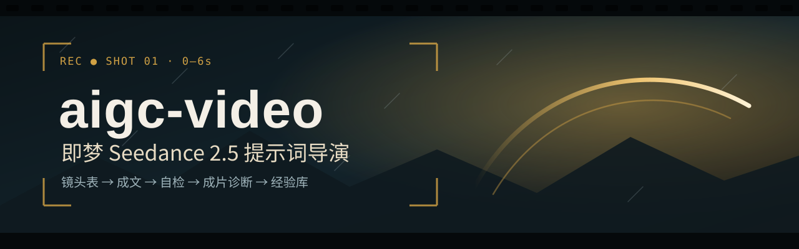
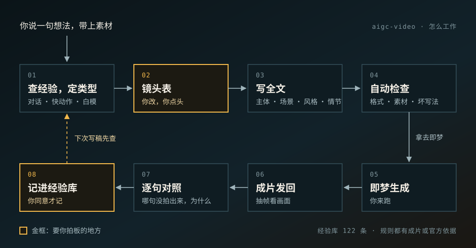

<div align="center">

# aigc-video

[](CHANGELOG.md)
[](#能做什么)
[](#安装)
[](references/lessons/)
[](references/lexicon/)
[](tests/)

<br>

**告诉它人物、场景、动作和素材，它写出能直接粘进即梦的提示词。**

<br>

它不负责把话写漂亮，负责把每一镜写清楚：画框切在哪、人朝哪边、动作停在什么样子、光打在哪。<br>
多镜头的片子先给你一张镜头表，你改完点头，它再写全文。<br>
成片发回给它，它逐句对照哪句拍出来了、哪句没有；你同意后把问题记进经验库，下次写稿先查。

```bash
git clone https://github.com/Wanrd0Geri/aigc-video ~/Documents/Codex/aigc-video
bash ~/Documents/Codex/aigc-video/install.sh
```

[能做什么](#能做什么) · [怎么工作](#怎么工作) · [八条原理](#八条原理) · [实测结果](#实测结果) · [安装](#安装) · [更新记录](CHANGELOG.md)

</div>

---

## 能做什么

| 你说 | 你拿到 |
|---|---|
| 写一条新片：人物、场景、动作、时长、素材 | 多镜头先给一张**镜头表**，每格都能改；你点头后给完整提示词（代码块，下面附一行检查结果） |
| 只有一个镜头，或说「直接出」 | 一次给完整提示词 |
| 贴上旧提示词，说哪里要改 | 交回整份新稿：只改出问题的那几句，其他镜头一字不动，并标出改了哪里 |
| 延长、编辑、衔接、首尾帧、宫格、白模、绿幕 | 按即梦官方格式写好的操作命令，必填项不漏 |
| 发回成片或截图，说说你的看法 | 逐句对照哪句拍出来了、没拍出来的原因、最少改哪几句；你说「写入经验库」才记 |
| 「自检」 | 一句结论，只列有问题的地方；不改稿 |
| 「这个效果叫什么」「怎么写」「拔高」 | 查词库直接回答，或给 3–5 个候选，你选了再写进稿子 |
| 「整理经验」 | 每条规则用了几次、在成片里管不管用；哪些经验能升级、能合并、互相冲突。你点头才改 |

直接这样说就行：

```
「苏云站在积雪的大殿屋脊上，远处是极光下的山城；他一沉一蹬跃起，金臂在空中划出一道光，
  落在更高一层的屋脊上压低身子抬眼。6 秒单镜，国风写实 CG，运镜你定，别拖沓。」

「按这张白模交接卡写屋脊打戏的完整提示词：图1 白猿含长棍，图2 苏云，图3 场景氛围，视频1 白模。」

「这条成片第 3 秒他飞出画框了，帮我看看是哪句没写对。」
```

---

## 怎么工作



- **三套写法**：多人对话；单人或怪物的快动作；有白模或运镜参考视频。每次只用其中一套。
- **规则分两档**：有两条以上成片、官方说法或作者本人的说法支持的，直接照做（17 条）；只有一条成片支持的，可以用，但会说明（10 条）。经验也分两档：试过的、没试过的。
- **坏写法清单**：已知会失效的写法，比如快镜头里写「慢慢」、写「露出全身」，列成一张表，检查脚本会自动提醒。
- **只读用得上的**：每次只读这次任务要用的几条规则，不把整个 skill 读一遍。

---

## 八条原理

写新稿和自检前先过一遍。下面是白话版，原文和出处见 [principles.md](references/principles.md)。

| # | 原理 | 举个例子 |
|:--:|:---|:---|
| 01 | **写看得见的、在动的东西，别写判断。** | 写「看向右前方」，成片可能转向左；要写从这个机位能看到哪些部位、画框切在哪 |
| 02 | **写了具体的东西，模型就会把它画出来。** | 写「有房子那么大」，会画出一座房子；写「龙卷风柱」，会画出一根实心柱子 |
| 03 | **参考图和参考视频，比文字说了算。** | 场景图的构图会被带进开场；白模的方块会被画成立方体，文字压不住 |
| 04 | **要求「一直不变」会把主体钉死，要求「全都装下」会把镜头拉远。** | 写「位置大小不变」，主体会钉在画框里不动；写「露出全身」，模型会自己拉成远景 |
| 05 | **一条成片说明不了问题；朝向、形状、构图不对，先重跑再改。** | 同一份稿跑三次，朝向和构图本来就会变；只看一条片就改写法，常常改错 |
| 06 | **时长多长，就写多少内容；塞满了就会丢。** | 一个动作大约 0.5 秒；1 秒里塞两个以上不相连的动作，就会漏拍或糊成一团 |
| 07 | **白模只管怎么动、什么时候动；长相看角色图，环境看场景图和文字。** | 白模的方块和颜色会被原样画出来，所以只拿它定机位、路线和节奏 |
| 08 | **特效有参考视频，比用文字描述准。** | 文字写的特效形状会乱跳；只能用文字写闪电时，写清数量、粗细、分叉 |

另外几条默认做法：镜头要不要动，看说不说得出理由，说不出就固定机位；一个镜头里不按秒排动作，要卡点时除外；同一个要求换两种写法都没拍出来，就换办法，或者建议接受现在这一版。

---

## 实测结果

每次改版都在即梦上生成成片对比，不只看文字。下面是 v45（2026-10-07）的结果。

**读得更少。** 让 AI 按真实任务跑一遍，数它每次读了多少字：

| 任务 | v44（字） | v45（字） | 变化 |
|---|---:|---:|---:|
| 多镜头新稿（镜头表 + 全文，两轮） | 120,873 | 78,017 | **−35%** |
| 白模打斗 | 127,078 | 84,907 | **−33%** |
| 改稿两轮 | 54,335 | 46,049 | −15% |
| 向后延长 | 46,408 | 33,434 | −28% |

**拍出来不比旧版差。** 同一个需求，新旧两版各写一份提示词，在即梦用 480p、同一天生成，打乱顺序盲评：

| 场景 | 条数 | 结果 |
|---|---:|---|
| 屋脊打戏（白模，7 个镜头，7 秒） | 3 | 不比旧版差，切镜时间更准 |
| 苏云屋脊跃起（单镜头，6 秒） | 5 | 第一轮发现新版漏写了指定的细节，修好重跑后和旧版持平 |
| 两人走位对白（3 个镜头，8 秒） | 3 | 新版两条都排在旧版前面 |

装之前又请 Codex 检查了两轮，发现并修好一处问题：读某几条规则时会漏掉后半段。完整报告、盲评材料和成片在作者本地。

---

## 安装

Claude Code 和 Codex 共用一份文件：

```bash
git clone https://github.com/Wanrd0Geri/aigc-video ~/Documents/Codex/aigc-video
bash ~/Documents/Codex/aigc-video/install.sh
```

`install.sh` 会在 `~/.claude/skills/aigc-video` 和 `~/.codex/skills/aigc-video` 建软链，指向这份仓库。原来已经有的目录会先挪到 `~/Documents/Codex/skill-backups/`。

只需要 Python 3（只用标准库）和 ffmpeg（成片抽帧用。Mac：`brew install ffmpeg`；Windows：`winget install Gyan.FFmpeg`）。Windows 上把命令里的 `python3` 换成 `py -3`。换新电脑的完整步骤见 [SETUP.md](SETUP.md)。

**更新**：`bash scripts/sync.sh --pull`，或者 `git pull`。不要在 skills 目录里另放一份拷贝，也不要用 `git clone` 盖掉软链。

---

## 仓库里有什么

<details>
<summary><b>目录结构</b>（点开）</summary>

```
SKILL.md                     入口：写前七问、必须守住、用户偏好、任务路由、字段深度、轻量 / 全套交付
references/
  principles.md              八条原理
  seedance-format.md         四段格式、素材引用、时间戳、声音、禁止项、硬限制、表头 / 镜头表 / 公开交付
  seedance-operations.md     延长、编辑、首尾帧、关键帧、宫格、白模、绿幕、衔接、成片
  writing-rules.md           成文主规则 8 条、五道门、决策表 D01–D17、建议行 10 行、去处表
  writing-rules-annex.md     附录 1–83 条细则与例句（按条号读，读到下一条为止）
  modes/                     三张模式卡：多人对话 / 单主体动作与生物 / 白模或运镜参考
  antipatterns.md            反模式表：触发正则、为什么、证据等级、改成
  craft/                     10 张工艺卡：镜头、光影、表演、站位、运动物理、打斗、特效、场景氛围、题材配方、导演提案
  lexicon/                   11 张词库 989 条：运镜、动作打斗、运动、光线材质、表演、四张特效表
  cases/                     官方案例库 + 我的成功案例（只给组织方式与句式样板）
  lessons/                   经验库 122 条 + 自动生成的分类索引 index.md
  review/                    自检展示、成片诊断、改稿规则、严格审九步
scripts/
  check_prompt.py            格式、素材、时码、锁定与反模式提醒（参数见 --help）
  verify_delivery.py         交付前重跑检查，可直接生成可粘贴的成品文件
  extract_frames.py          抽帧 + 切镜检测 + 拼图（macOS / Windows 通用）
  build_lessons_index.py     从经验库生成分类索引；--check 只校验
  log_lesson.py / merge_lessons.py / lint_*.py      经验库与案例库、词库的写入、合并、体检
  log_outcome.py / rule_stats.py / review_lessons.py 成片评价记录与「整理经验」统计
hooks/                       可选 Stop 钩子（两个宿主通用），本体不依赖它
tests/                       五套回归：check_prompt 819 项、修订 18、交付放行 69、钩子 71、经验脚本 9、规则统计 2
```

</details>

---

<div align="center">
<sub>每条规则都要有官方依据或成片实测 · 版本号是本 skill 自己的，不对应即梦或 Seedance 的版本</sub>
</div>
